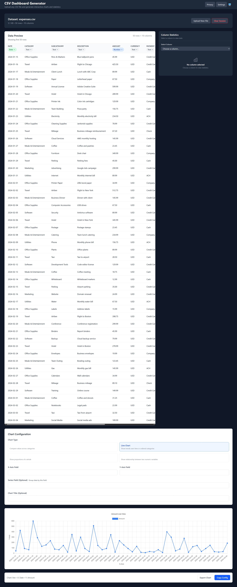

# CSV → Dashboard Generator

Upload any CSV and get instant charts + summary stats. Great for quick insights without spreadsheets.



## ✨ Features

* Drag-and-drop CSV upload
* Auto-detect numeric vs categorical fields
* KPI cards (sum, mean, min/max), column stats
* Visualizations: line, bar, pie, scatter
* Client-only mode or API mode (FastAPI/Node)

## 🧰 Tech Stack

* Frontend: React + Vite, Papaparse, Chart.js
* Optional API: FastAPI (Python) or Hono (Node)
* TypeScript throughout

## 🚀 Quick Start (Frontend-only)

```bash
git clone https://github.com/YOURUSER/csv-dashgen
cd csv-dashgen/web
npm i
npm run dev
```

## 🚀 Quick Start (Full-stack, Python API)

```bash
# Frontend
cd csv-dashgen/web && npm i && npm run build
# Backend
cd ../api-py
python -m venv .venv && source .venv/bin/activate
pip install -r requirements.txt
uvicorn app:app --reload
```

## 🗂️ Project Structure

```
/web
  src/
    main.tsx
    App.tsx
    components/
      Uploader.tsx
      FieldPicker.tsx
      Charts.tsx
      Stats.tsx
  public/
  vite.config.ts
/api-py
  app.py
  requirements.txt  # fastapi uvicorn pandas numpy
/docs
  dashboard.png
  upload.png
README.md
```

## 📁 Sample Data

* `samples/sales.csv`
* `samples/expenses.csv`
* `samples/fitness.csv`

## 🧪 Demo Flow

1. Upload `samples/sales.csv`
2. Pick x=Date, y=Revenue → line chart
3. View auto KPIs + “Top 5 categories”

## ⚙️ Env (if using API)

```
API_PORT=8000
MAX_UPLOAD_MB=10
```

## 🧭 Roadmap

* Smart chart suggestions
* LLM “insight sentences” from the data
* Save dashboards (localStorage/DB)

## 📝 License

MIT
